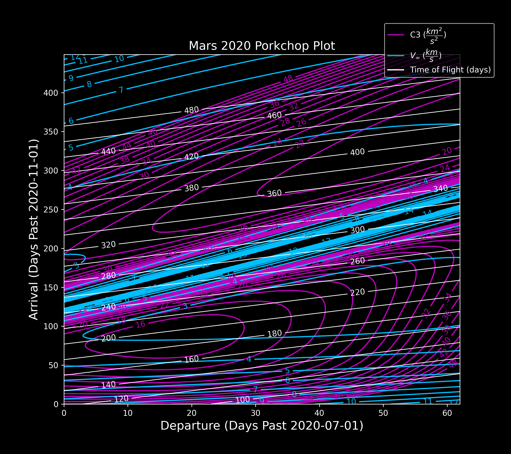
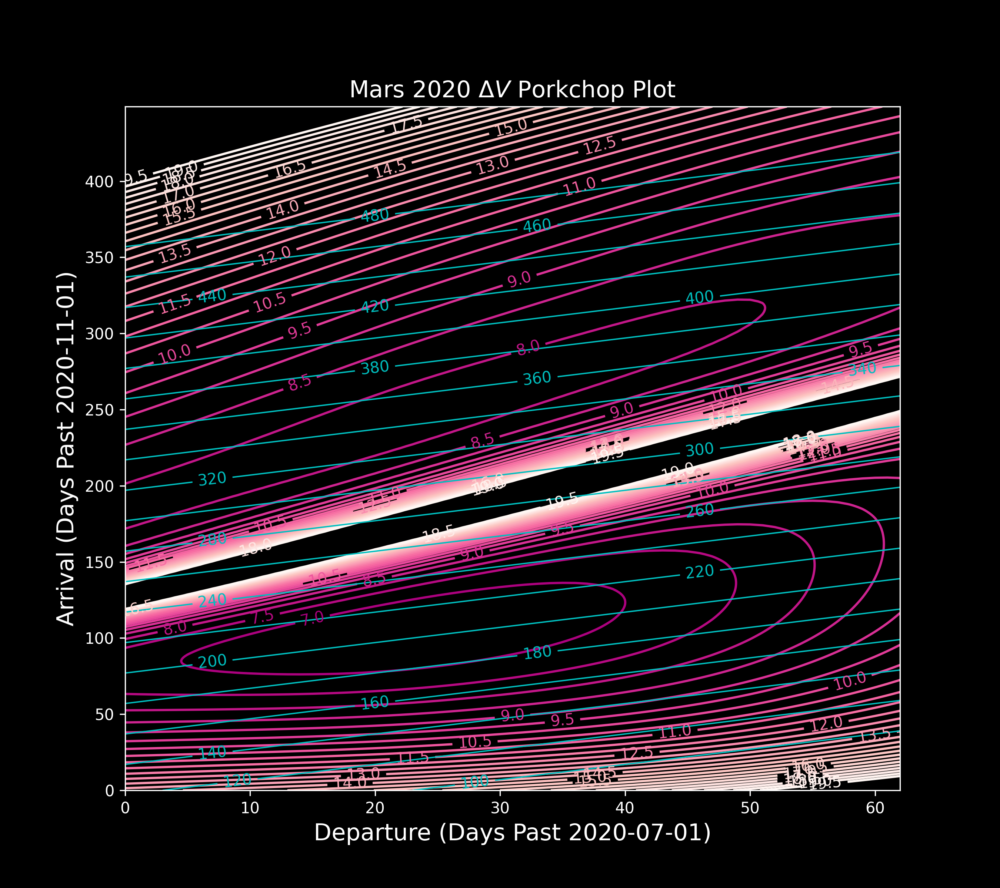

# Porkchop Plot Generator

This project generates porkchop plots for interplanetary trajectory analysis. The plots provide valuable insights into the delta-v requirements for different transfer opportunities between celestial bodies.

## Features

* Fetches data from JPL Horizons API
* Computes Lambert solutions for given departure and arrival windows
* Visualize results with contour plots

## Example Plots
Below are example plots generated by this tool:





## Dependencies
* [Python 3.0+](https://www.python.org/)
* [NumPy](https://www.numpy.org/)
* [Matplotlib](https://matplotlib.org/stable/index.html)

### Installing Python Dependencies
Python packages can be easily and conveniently installed using `pip` via the command-line like so:
```sh
$ python3 -m pip install {package_name}
```

In the case of this repository, all python dependencies can be installed in one command using the requirements.txt file:
```sh
$ python3 -m pip install -r requirements.txt
```

## Usage 
To generate a porkchop plot, run the following:
```sh
$ python3 main.py
```

### Configuration parameters
The user can modify the following parameters in the main.py file:
```py
# config parameters for porkchop plot generator
config = {
    'planet0'       : planetary_data.earth[ 'ID' ], # Departure planet
    'planet1'       : planetary_data.mars[ 'ID' ],  # Target planet
    'departure0'    : '2020-07-01',                 # Intial departure date
    'departure1'    : '2020-09-01',                 # Final departure date
    'arrival0'      : '2020-11-01',                 # Initial arrival date
    'arrival1'      : '2022-01-24',                 # Final arrival date
    'mu'            : pd.sun[ 'mu' ],               # Gravitational parameter
    'step'          : 5,                            # Step size in days
    'frame'         : 'J2000',                      # Ecliptic of J2000
    'observer'      : '500@0',                      # Solar Sytem Barycenter
    'cutoff_v'      : 20.0,                         # Maximum vinf   
    'c3_levels'     : None,                         # C3 levels for contour plot
    'vinf_levels'   : None,                         # vinf levels for contour plot
    'tof_levels'    : None,                         # tof levels for contour plot
    'dv_levels'     : None,                         # dv levels for contour plot
    'dv_cmap'       : 'RdPu_r',                     # color map for dv contours
    'figsize'       : ( 6, 10 ),                    # figure size for contour plot
    'lw'            : 1.5,                          # linewidth for contour lines
    'title'         : 'Porkchop Plot',              # Plot title
    'fontsize'      : 15,                           # Axes fontsize
    'show'          : True,                         # For displaying the figure
    'filename'      : None,                         # Specify filename for C3 plot
    'filename_dv'   : None,                         # Specify filename for dv plot
    'dpi'           : 300,                          # Specify target dpi
```